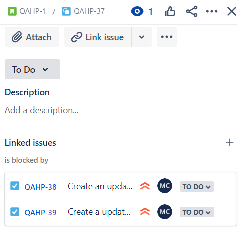
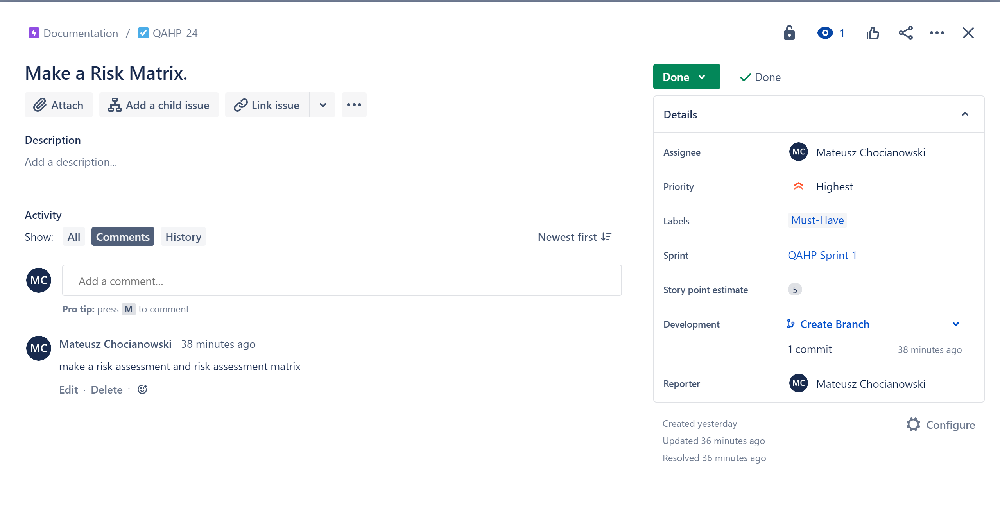
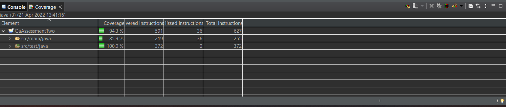

Coverage: 85.9%

[My Final Presentation](documentation/Final-Presentation.pptx)

# **QA Assessment: 2**
# **_CRUD Application Hobby Project_**

## **_Introduction_**
This is my second of three assessments for the QA Academy. The project required a crud application which would allow the user to create, read, update and delete items in an entity. The application is required to have a functioning front-end through the usage of HTML, CSS and Javascript as well as a functioning back-end using Java and the Spring framework. The requirements for this project have been met through usage of various technologies described further in this document and consisted of: Git, Jira, Github, HTML, CSS, Bootstrap, Java, Spring and MySQL.

## **_Getting Started_**
In order to get started on the project I first needed to start by planning it. To achieve this I used Jira software so that I was able to work in an agile way. Having considered the user stories and tasks related to them for a complete project meeting the MVP I was able to start my sprint; thus moving onto the next step of creating some initial wireframes, carefully considering what whould be included in a desktop(Figure 1) and mobile (Figure 2) version of the web app in order to meet the user stories. Once these were complete I created an empty GitHub repository. Once the Github repository was created I then opened up Eclipse and started a new Spring project. Having done so allowed me to initiate the local repository as a git repository and create the README.md file and the LICENSE.md file. I then set a new remote repository equal to the one I had created in GitHub (Using the HTTPS key) and was ready to push my first commit. 
Figure 1: 
 
Figure 2: 
 

## **_Project Planning_**
* **The UML diagram:**    
* [The risk assessment](documentation/QA-Assessment-2-RiskAssessment.pdf) 
* [The risk assessment matrix](documentation/QA-Assessment-2-RiskAssessmentMatrix.pdf) 

## **_Prerequisites_**

* **Github** 

Github is a free platform to aid managing version control of your projects. a free account can be created [here](https://github.com/). Once the account is created you have access to Github's platform- within it you have our repository and can find lots of repositories from your colleagues or open source projects.    

* **Jira Software**  

Jira is free software used to implement Agile methodology using a Kanban board. All that is required is an account to get started however within the software there are instructions on connecting to GitHub for the use of commit messages within your Kanban board.

* **Git**  

Git is the version control system used to communicate between your local machine and github. The latest version is 2.35.1 for windows and can be installed [here](https://git-scm.com/download/win). Unlike other software in this document, Git doesn't require any other special attention other than following the instructions in the installer and choosing the best options for your needs.

* **Java**   
*_Java needs to be installed in order to develop any java projects. It can be downloaded [here](https://jdk.java.net/java-se-ri/16)._*

Java 14 is the minimum requirement but downloading the latest version will guarantee you won't face issues and will definitely last longer if you're not someone who constantly searches for new updates in all their software. Once the file has been downloaded, locate it and click the executable jdk-"version number" file which will open a window, click next, then click next and next again, in the next window you can click clos which will start the installation. Next you need to set the environment variable on your machine, on windows search for environment variables in start, and click on the option which says "Edit the system environment variables" a system properties windows opens and you should click the environment variables button. Choose System variables and click new, in the pop up window create a variable named JAVA_HOME and the value should correspond to the path of the JDK folder, click ok. now scroll within the system variables windows to find Path, click on this and select edit, inside you need to append the path of the Java /bin folder to this path variable so reference the JAVA_HOME like this: %JAVA_HOME%\bin (make sure that there is a semi-colon before and after %JAVA_HOME%\bin).To test that this has saved, open command prompt, and type "java" and hit enter. If the Path variable has been configured correctly then the OS will run the file called "Java" in your JAVA_HOME /bin folder (Java.exe) and you should see this output: 
  

* **Maven**  
*_Can be downloaded from [here](https://maven.apache.org/)._*

Run the downloaded file like you did for java and then again navigate to the Environment Variables menu set two variables; M2_HOME and MAVEN_HOME - both of which should point to the path of your Maven install folder. (You need both, as certain programs reference Maven in different ways.) Now edit the Path variable in the same way we did for JAVA_HOME: %MAVEN_HOME%\bin; To verify that Maven is installed correctly, open a command line and enter the following command: mvn -version.

* **MySQL** 

*_MySQL can be downloaded [here](https://dev.mysql.com/downloads/windows/installer/8.0.html)._*

Once downloaded run the installer. You may be see pop-ups asking to allow the installer to change your system - click ok/accept on these. Once the installer is running you should see a screen asking you to choose a Setup Type; choose Custom and click Next. Now you need to select what software is installed. You will need to select:
* The newest MySQL Server from MySQL Servers.
* The newest MySQL Workbench from Applications.
* The newest Samples and Examples from Documentation. 

Once these are selected, click Next. You should now be on the Download page; click Execute. It should take a few moments for it all to be downloaded to your machine. Once the downloads are finished, click Next. You should now be on the Installation page; click Execute. It should take a few moments for the installation to finish. Once the installation is finished, click Next. You should now be on the Product Configuration page, click Next. You should now be on the Type and Networking page, click Next. You should now be on the Authentication Method page, click Next. You should now be on the Accounts and Roles page. Enter a password for the root (admin) account into the two password fields. (Use something easy to remember like pass or root because if you forget it you're going to have to re-install MySQL) Then, click Next. You should now be on the Windows Service page, click Next. You should now be on the Apply Configuration page, click Execute. Once the configuration has been successfully applied click Finish. You should now be on the Product Configuration page, click Next. You should now be on the Connect To Server page, enter the password and click Check. If the connection succeeded, click Next. You should now be on the Apply Configuration page, click Execute.
Once the configuration is applied, click Finish. You should now be back on the Product Configuration page, click Next again. You should now be on the Installation Complete page, click Finish. This will open MySQL Workbench. 
Set up the MySQL environment variable
In the Start Menu, search for 'env' and click the option to edit system environment variables Click Environment Variables. In the bottom System Variables panel of this window, click New, then, in the window which opens, replicate the following setup: Variable Name: MYSQL_HOME. Variable Value: path to MySQL Server.
Click OK, then scroll in the bottom panel until you find the Path variable. Select it and click Edit, then New and add %MYSQL_HOME%\bin. Click OK recursively until all system windows are closed.

* **Eclipse** 
*_Eclipse is and ide for Java, it can be downloaded for free [here](https://www.eclipse.org/downloads/)._*  
When possible run the installer. You could get a security warning pop up to run this file. Select run if you are certain you are downloading from the site provided.   
The Eclipse Installer shows the packages available. You can search for the package you want to install or scroll through the list.  
Next you will need to specify the folder where you want Eclipse to be installed. 
  
Once the installation is complete you can launch Eclipse. 

* **Spring** 
Spring is a framework which can be installed on Eclipse by navigating to 'Help' -> 'Eclipse Marketplace' -> Search for Spring tools 4 and install this. The file you will be looking for looks like this:  

Once you have successfully installed this Eclipse add on you may go ahead and create a new spring project which will be described futher down. However right now just be aware that due this installation you may need to restart Eclipse and also all dependencies will be available to you when it comes to project creation.

* **VSCode** 
Microsoft Visual Studio Code is a free source code editor which unlike eclipse supports many languages. Of course some people may prefer to use a code editor specific to the language they are working in. However for front end languages VSCode with a few plugins has been good to me. Installing VSCode is easy, quick and can be found [here](https://code.visualstudio.com/). Once installed you can simply open VS code and start to code, for this project I used the following plugins which can be installed in the VS code extensions marketplace: Live server and Prettier. Live Server allows us to open a preview of our front-end code whilst Prettier enables us to easily format our HTML, CSS and JS code.

* **PostMan** 

Postman is a standalone tool that utilises web APIs by making HTTP requests from outside the service. Postman allows you to test user created end-points efficiently and can be downloaded [here](https://www.postman.com/downloads/). Again just like with VSCode the installation is quick and easy. Postman will be ready to use straight after by simply launching the app.

## **_How these technologies were used_**

* **Github And Git** 

I have used Github for version control. I implemented feature branches to manage each new feature developed within the project. To do this we can use the git command git branch branchname to create a new branch or git checkout -b branchname to create and immedietly start working in the new branch. I used pull requests and merges to merge from a feature branch to the dev branch, which when ready will be merged into main. 

* **Jira** 

I used jira for planning my project. I created issues in the form of user stories and tasks. User stories have acceptance criteria which need to be met and are in the description of the issue. User stories would also have child issues(Figure 5) in the form of tasks which needed to be completed in order for the acceptance criteria to be satisfied. Some child issues would be either used to block or were blocked by other tasks within the board- a block is when another issue stops the issue in question from being completed this introduces some order to the project. I Also connected Github to Jira which allowed smart commits which meant that my work was commenting onto the jira issue I specified when making a commit to Github(Figure 6). Again this is useful for order and tracking project progress to see which tasks have work against them making me 100% I am sticking to plan and completeing the assigned tasks.

* **Maven** 

Maven was used to handle project dependencies and was actually preimplemented by the spring starter project.

* **MySQL** 

MySQL was used to create a database and be the local server for my project. This was one of the last things I did as throughout development I just used a h2 server to tes the functionality of the project.

* **Eclipse** 

Eclipse is an IDE specially for coding in java and supports the Spring framework from its marketplace. Therefore Spring was my go to IDE for coding and setting up the backend of the application.

* **Spring Boot** 

I used the Spring Boot framework to bulid the application. The Spring starter project available to me from Eclipse had premade all pre-required files and folder including Maven Dependencies and a git ignore file.

* **VS Code** 

I used VS code and an extension called prettier to write up my front end and the javascript to handle the communication between front and back-end. VS code is a simple to use IDE in my opinion and supports losts of languages therefore this is why I used it to handle the front end languages.

* **Postman** 

I used Postman to test that the backend worked without having a front end made for my application. This was useful in sense that I was 100% certain my backend worked before connecting my front end to it, which in turn probably halved m debugging process.

* **HTML, CSS, JS** 

I used HTML(Hypertext Markup Language) to display information on a webpage to the user. CSS enabled me to style my HTML code. Javascript allowed me to add interaction to my webpage by allowing me to connect the front end to my back end.

* **Java** 

I used Java along with the Java framework Spring Boot to develop my back end.

* **Bootstrap** 

I used Bootstrap to add a navbar to my application and also for bootstrap grid which allowed me to program my web app with a mobile first design.

## **_Testing_** 

For this project I used integrated testing to test my back-end. The Spring boot Test was used for these tests and all that was need was the @SpringBootTest annotation at the top of my test class. I used object mocking using the controller layer of the application for my test and mocked the controller class using MockMVC and the @AutoConfigureMockMvc annotation. This allowed me to test 85.9% of my back-end application which is higher than the 80% industry standard (figure 7). 

## **_Deployment_**

Although this project is not a project which is being deployed I'd like to take the opportunity to demonstrate my knowledge of project deployment. Firstly deploying a project is what makes it live, until the project is deployed it can only be accessed within the repository so only code and any preview tools such as Gitpod's preview tool can be used to see a preview of what the live application would look like. Web applications will be deployed via Github settings, if being deployed via Github. However they can also be deployed via other means such as Heroku this would involve connecting the master branch to Heroku and then push your commits and deploying the app via the Heroku dashboard. Deploying via cloud platforms such as Heroku or AWS can be an in depth process. 

An application such as this one where there is a front and back-end section to the application requires a server inorder to remain fully functioning, this can be done either by hosting a local server or cloud server which is down to the developer or in larger cases the project manager or the company - In other words the person who would be covering the cost of running the application. Local servers are cheaper as it is a one off cost to purchase a server or a second machine dedicated as a server, however things like running costs would also need to be factored in. On the other hand cloud servers are handy as storage is often expandable with a matter of clicks if the company was to grow or the application of a sole developer becomes so successful that he/she would need to consider this. Cloud server examples examples include Google Cloud Platform (GCP) and Amazon Web Services (AWS).  

Further to the above an example of deploying a Spring boot application through Heroku for example can be done like this as one of many ways(The below example can slaso be found [here](https://www.callicoder.com/deploy-host-spring-boot-apps-on-heroku/) as well as a few other ways of depolying a spring boot app with heroku: 

* Firstly, specify the port that the application should listen to in a property named server.port in the src/main/java/resources/application.properties: server.port=${PORT:8080}
* Secondly, Enter the following command in your terminal to install the heroku-cli-deploy plugin: heroku plugins:install heroku-cli-deploy
* Package your Spring Boot application.(Just like in the QA-Project-One IMS Project) You can do that using mvn package command: mvn clean package
* Create a Heroku app by running this command: heroku create <APP-NAME> --no-remote
* Notice the use of --no-remote option. This tells heroku to not setup any git remote repository.
* Deploy the jar file on Heroku: heroku deploy:jar target/heroku-demo-0.0.1-SNAPSHOT.jar --app <APP-NAME>

For local deployment of apps the end user can begin by navigating to the GitHub repository then clicking the Code drop down menu the user can choose to Download the ZIP file, unpackage locally and open with IDE (This route ends here). 

Or alternatively copy the Git URL from the HTTPS dialogue box. Open the development editor of choice and open a terminal window in a directory of  choice. Then using the 'git clone' command in terminal followed by the copied git URL. Finally a project clone will be created locally on the users machine.

## **Built With**

* [Java](https://www.oracle.com/java/technologies/javase/jdk14-archive-downloads.html) - Programming Language

* [Maven](https://maven.apache.org/) - Dependency Management

* [Spring](https://spring.io/projects/spring-boot) - Creating a functioning back-end appliction.

* [HTML](https://www.w3schools.com/html/) - Hyper Text Markup Language for writing the visual aspects of the site.

* [CSS](https://www.w3schools.com/css/) - Used to make the HTML more visually apparent

* [Bootstrap](https://getbootstrap.com/) - Used to implement a mobile friendly design, and implemeting further CSS.

* [JavaScript](https://www.javascript.com/)- Used to communicate between the front-end and the back-end.

* [MySQL](https://dev.mysql.com/downloads/windows/installer/8.0.html) - Relational Database (SQL) community server.

## **Versioning**

We use [SemVer](http://semver.org/) for versioning. 

**This is version 1.0.0**

## **Authors**

* **Mateusz Chocianowski** - *Project planning, creation, updating.*

## **License**

This project is licensed under the MIT license - see the [LICENSE.md](LICENSE.md) file for details 

*For help in [Choosing a license](https://choosealicense.com/)*
